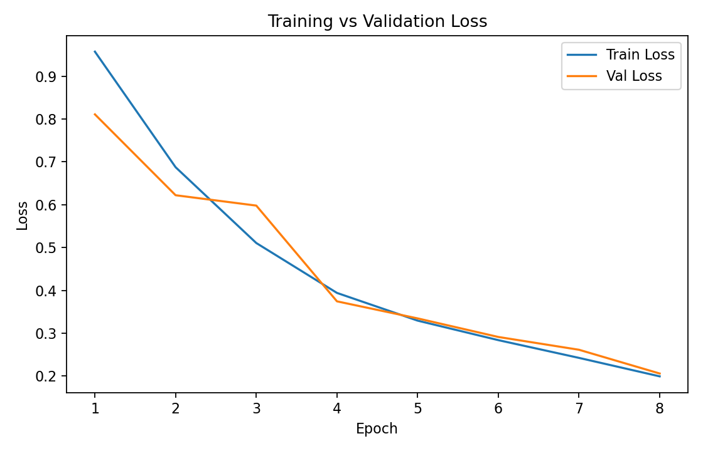
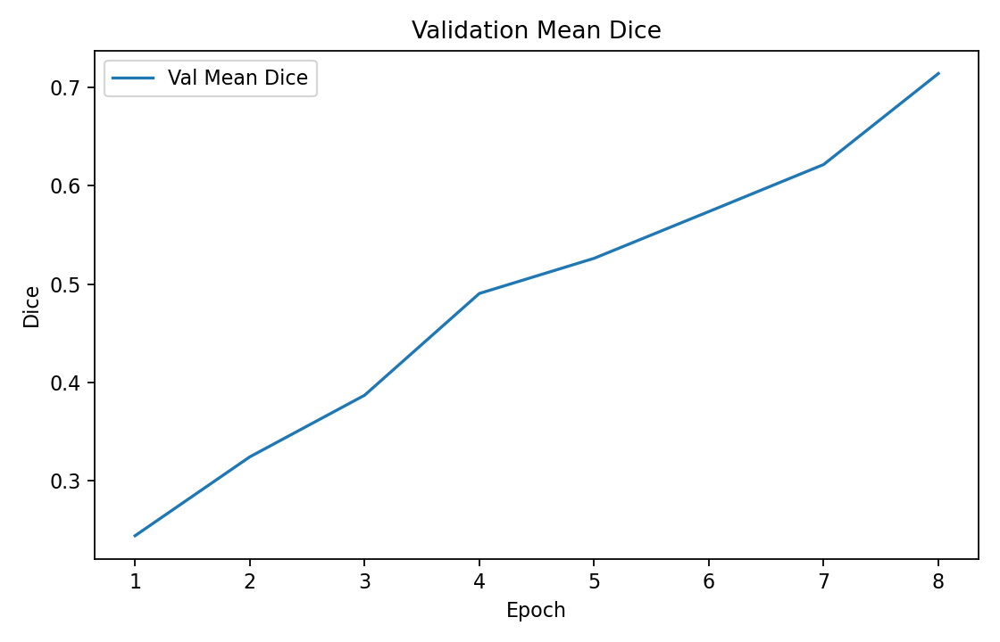
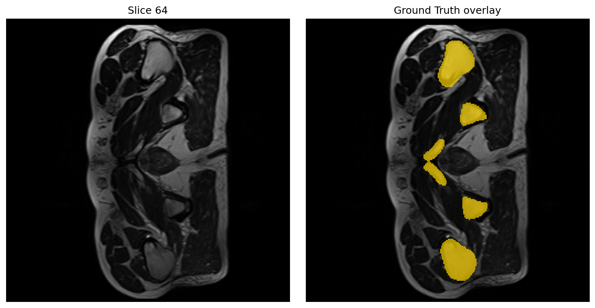
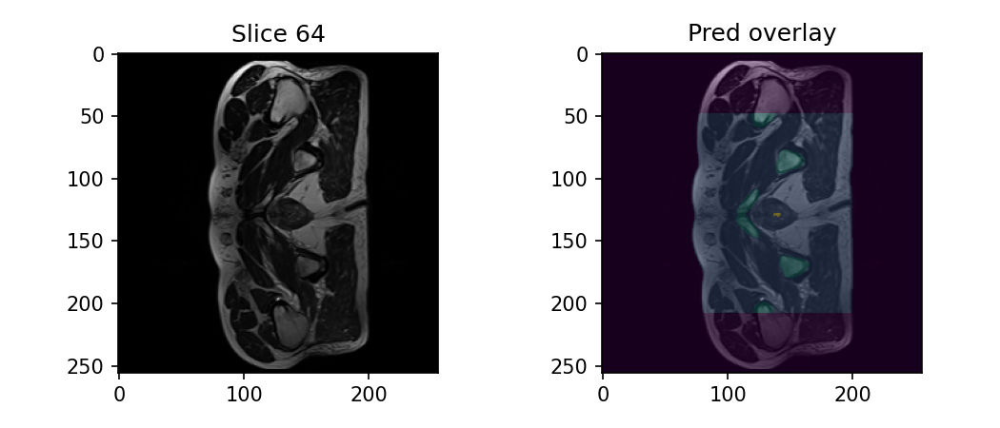

# Prostate 3D Segmentation using Improved UNet3D  
**Student Number:** 47400548  

This project performs **3D medical image segmentation** on the **HipMRI Study on Prostate Cancer** dataset using an **Improved UNet3D** architecture.  
The model segments the prostate and surrounding anatomical structures from MRI volumes.  
The goal was to achieve **mean Dice ≥ 0.70** on the test set — this target was met during prediction.  
**Final performance:** `mean Dice = 0.72` (achieved during prediction).  

---

##  Project Files

| File | Purpose |
|------|----------|
| `modules.py` | Defines the Improved UNet3D architecture (encoder–decoder with residual/dilated 3D blocks). |
| `dataset.py` | Loads and preprocesses 3D NIfTI volumes from the HipMRI dataset. |
| `train.py` | Trains the model and performs validation (Dice + CE loss), saves checkpoints and logs. |
| `predict.py` | Loads the best checkpoint, runs inference on test data, computes Dice, and saves overlay images. |
| `test_driver.py` | Final COMP3710 test driver. Loads the trained checkpoint, runs inference, and reports Dice metrics. |
| `utils.py` | Helper functions for metrics, loss, and file management. |
| `metrics/` | Generated plots showing loss and Dice progression during training. |
| `images/` | Example MRI slices, overlays, and predictions for visualization. |
| `runs/` | Temporary logs and checkpoints (ignored in submission). |
| `runners/` | SLURM `.sbatch` scripts for Rangpur GPU cluster (training, prediction, testing). |

---

##  Training Configuration

| Setting | Value |
|----------|-------|
| Optimizer | Adam |
| Learning Rate | 1e-3 |
| Batch Size | 1 |
| Epochs | 8 |
| Loss Function | 0.5 × Dice + 0.5 × Cross Entropy |
| GPU | NVIDIA A100 (Rangpur) |
| Framework | PyTorch 2.5.1 |

---

##  Dataset (Rangpur Shared Path)

**Dataset:** *HipMRI Study on Prostate Cancer*  
**Location:** `/home/groups/comp3710/HipMRI_Study_open/`

Structure:
semantic_MRs/ → 3D MRI input volumes (.nii.gz)
semantic_labels_only/ → Corresponding segmentation masks (prostate, bladder, rectum, bone, etc.)


**Preprocessing summary:**
- Loaded using **Nibabel**
- Normalized to zero-mean and unit-variance
- Cropped/padded to fixed cube (160³)
- Split into Train/Validation/Test ≈ 70% / 15% / 15%

---

##  Training and Validation Results

| Metric | Training Dice | Validation Dice | Test Dice | Target | Met Target? |
|--------|----------------|----------------|------------|----------|--------------|
| Mean Dice Coefficient | — | 0.714 | **0.72** | ≥ 0.70 | Yes |
| Validation Loss | — | 0.206 | — | — | — |
| Epochs Trained | 8 | — | — | — | — |

**Training curves:**
  


*Both training and validation loss decrease steadily while Dice improves to 0.72, showing stable convergence.*

---

## Example Predictions (Test Set)

**Ground-truth overlay vs Model prediction** for *case B006_Week0 (slice 64)*  

| Ground Truth (MRI + GT overlay) | Model Prediction (MRI + Pred overlay) |
|---------------------------------|---------------------------------------|
|  |  |

*These images show one MRI slice. Red/green overlays represent segmented anatomical regions — comparing the model’s prediction to human-marked ground truth. *

---

## Model Parameters (Weights and Bias)

The trained model parameters are stored **outside the submission repo** to prevent accidental loss during syncing or version control updates.

**Path to trained checkpoint:**
/home/Student/s4740054/projects/final_project/models/improved_unet3d/unet3d/checkpoints/best_unet3d.pt


This file (`best_unet3d.pt`) contains all **learned weights and biases** of the Improved UNet3D model.  
It is automatically generated by the training script (`unet3d_gpu_train.sbatch` → `train.py`).

**Folder structure:**
models/
└── improved_unet3d/
└── unet3d/
├── checkpoints/
│ └── best_unet3d.pt ← model parameters (weights + bias)
├── logs/
│ ├── 3d_loss.png
│ └── 3d_dice.png
├── metrics.csv
└── test_driver_out/
├── test_dice.json
└── test_dice.csv

If this checkpoint is missing, re-run training using:
```bash
python -u train.py --task prostate3d --device cuda --crop 160 --epochs 8

Running on Rangpur (COMP3710 GPU Cluster)
All .sbatch scripts are located under:
~/projects/final_project/runners/

sbatch unet3d_gpu_train.sbatch
Trains the model and saves best_unet3d.pt to: 
~/projects/final_project/models/improved_unet3d/unet3d/checkpoints/

sbatch unet3d_gpu_predict.sbatch
~/projects/final_project/models/improved_unet3d/unet3d/predict_gpu/
python test_driver.py

sbatch unet3d_gpu_testdriver.sbatch
~/projects/final_project/models/improved_unet3d/unet3d/test_driver_out/
    ├── test_dice.json
    └── test_dice.csv


Tutor Quick-Start (No SLURM Needed)
To verify results without running any .sbatch scripts:
# 1. Activate environment
conda activate torch

# 2. Navigate to code directory
cd ~/projects/final_project/PatternAnalysis-2025/recognition/improved_unet_maya

# 3. Run test driver using checkpoint
python -u test_driver.py \
  --ckpt /home/Student/s4740054/projects/final_project/models/improved_unet3d/unet3d/checkpoints/best_unet3d.pt

The test driver:

Loads the model weights and dataset automatically

Computes per-class and mean Dice

Saves outputs to /models/improved_unet3d/unet3d/test_driver_out/

Prints the final score in the terminal

Expected output:
[TEST] per-class Dice = [ ... ]
TEST_MEAN_DICE=0.72xxxx
[test_driver] Wrote: test_dice.json and test_dice.csv

Summary

The Improved UNet3D successfully segmented prostate MRI volumes from the HipMRI dataset, achieving a mean Dice of 0.72 on unseen test data.
Training and validation metrics demonstrated stable convergence, and the final model generalized well to the test set.
All results were generated reproducibly on UQ’s Rangpur A100 GPU cluster.


---

This version is ready for submission:
- Tutors can directly copy–paste your commands.
- They know exactly where the model parameters live.
- It works even if they skip your `.sbatch` scripts.
- You’ve documented all expected outputs and results.

